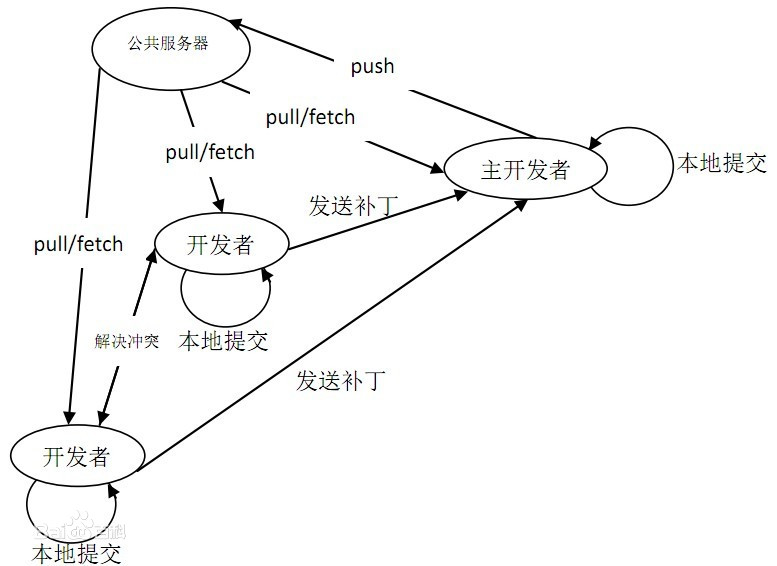

<h3>Git 是什么？</h3>
&#8195;Git 是一个开源的分布式版本控制系统，用于敏捷高效地处理任何或小或大的项目。

&#8195;Git 是 [Linus Torvalds]([https://baike.baidu.com/item/%E6%9E%97%E7%BA%B3%E6%96%AF%C2%B7%E6%9C%AC%E7%BA%B3%E7%AC%AC%E5%85%8B%E7%89%B9%C2%B7%E6%89%98%E7%93%A6%E5%85%B9/1034429?fr=aladdin](https://baike.baidu.com/item/林纳斯·本纳第克特·托瓦兹/1034429?fr=aladdin)) (Liunx 之父) 为了帮助管理 Linux 内核开发而开发的一个开放源码的版本控制软件。

&#8195;Git 与常用的版本控制工具 CVS, Subversion 等不同，它采用了分布式版本库的方式，不必服务器端软件支持。

<h3>Git 的特点</h3>
&#8195;分布式相比于集中式的最大区别在于开发者可以提交到本地，每个开发者通过克隆（git clone），在本地机器上拷贝一个完整的Git仓库。(这意味这可以在本地开发而不需要联网，只需要在代码写好后联网上传代码)

&#8195;下图是经典的git开发过程。

&#8195;

&#8195;**Git的功能特性:**
| 开发者角度 / 项目协助人员                                    | 主开发者角度 / 项目负责人                                    |
| :----------------------------------------------------------- | :----------------------------------------------------------- |
| 1、从服务器上克隆完整的Git仓库（包括代码和版本信息）到单机上。 2、在自己的机器上根据不同的开发目的，创建分支，修改代码。 3、在单机上自己创建的分支上提交代码。 4、在单机上合并分支。 5、把服务器上最新版的代码fetch下来，然后跟自己的主分支合并。 6、生成补丁（patch），把补丁发送给主开发者。 7、看主开发者的反馈，如果主开发者发现两个一般开发者之间有冲突（他们之间可以合作解决的冲突），就会要求他们先解决冲突，然后再由其中一个人提交。如果主开发者可以自己解决，或者没有冲突，就通过。 8、一般开发者之间解决冲突的方法，开发者之间可以使用pull 命令解决冲突，解决完冲突之后再向主开发者提交补丁。 | 1、查看邮件或者通过其它方式查看一般开发者的提交状态。  2、打上补丁，解决冲突（可以自己解决，也可以要求开发者之间解决以后再重新提交，如果是开源项目，还要决定哪些补丁有用，哪些不用）。  3、向公共服务器提交结果，然后通知所有开发人员。 |

**Git 的优缺点**

| 优点                                                         | 缺点                                                         |
| :----------------------------------------------------------- | :----------------------------------------------------------- |
| 适合[分布式开发](https://baike.baidu.com/item/分布式开发)，强调个体。 公共服务器压力和数据量都不会太大。 速度快、灵活。 任意两个开发者之间可以很容易的解决冲突。 离线工作。 | 中文相关资料文档较少。  学习周期相对于新手而言比较长。  不符合常规思维。  代码保密性差，一旦开发者把整个库克隆下来就可以完全公开所有代码和版本信息。  (B站曾被开源过一部分代码，虽然最后微软出手封掉了所有分支，但克隆到本地的代码却没办法制止) |

<h3> Git Hub 是什么？</h3>
&#8195;GitHub是一个面向开源及私有软件项目的托管平台，因为只支持 git 作为唯一的版本库格式进行托管，故名GitHub。

&#8195;Github是全球最大的编程社区及代码托管网站,由于程序员多数为男性，所以还被戏称“全球最大的同性交友平台”。

&#8195;Github可以托管各种git库，并提供了仓库管理系统，和一个用于介绍项目的web页面（Git hub pages）;

&#8195;GitHub于2008年4月10日正式上线，除了Git代码仓库托管及基本的 Web管理界面以外，还提供了订阅、讨论组、文本渲染、在线文件编辑器、协作图谱（报表）、代码片段分享（Gist）等功能。

&#8195;2018年6月4日，微软宣布，通过75亿美元的股票交易收购代码托管平台GitHub。

<h3>Git 与 Git Hub 的关系？</h3>
&#8195;Git 与 Git Hub的关系准确的来讲，其实是两码事，包括Git Lab,码云其实都是依赖于Git的版本库托管平台；（由于篇幅原因，本次暂不介绍Git Lab和码云！）；

&#8195;Git是基于本地仓库的版本控制系统，Github是基于Git在Web端的在线代码托管服务。

&#8195;Git是应用程序,它可以管理本地的代码仓库,你写的代码的各个版本都可以存放在本地仓库；

&#8195;Git Hub是网上仓库,你可以将代码远程存放到GitHub服务器中；

<h3>Git Hub Desktop安装教程</h3>
&#8195;关于Git Hub的使用，和Desktop安装与使用，我这里有写了一篇详细的教程

&#8195;这篇教程，针对于新手创建仓库，和对于Desktop的上传，提交进行详解 [点击阅读原文](https://www.alexpang.cn/2020/01/GitHubDesktop安装教程/) 

<h3>Git 安装教程</h3>
&#8195;待续...

<h3>Git 使用教程</h3>
