<h3>Git Hub Desktop 介绍</h3>
&#8195;Git Hub Desktop 是 Git Hub 提供的一款桌面版免费的客户端应用程序；

&#8195;之前我们讲到，Git Hub是基于 Git 的版本托管平台，但是 Git 所提供的 Git Bash 和 Git GUI 对于刚接触Git的新手来说并不是很友好，Git Hub 提供了Git Hub Desktop 弥补了可视化和重复命令行的短板；

&#8195;Git Hub Desktop 界面和功能简洁美观，省去了繁杂的选项花哨的功能，对于 git add,git commit,git push三连操作一键化执行；GUI界面操作对于新手来说，很容易就能熟练的对版本库进行上传合并、分支等操作，图形化的界面比起命令行更易于学习和使用，但个人并不推荐过渡依赖 Git Hub Desktop 而放弃命令行，毕竟还有一些基于内网的 Git 仓库无法使用Git Hub Desktop，而且使用 Git Bash也能让你在windows环境下使用一些简单的Liunx命令;

<h3>Git Hub 使用教程</h3>
&#8195;在安装Git Hub前，我们还需要先注册一个账号，并且会简单的创建仓库，查看仓库这一类的操作；

&#8195;如果你还没有Git Hub 账号，需要先注册一个账号；

​	**Git  Hub 账号注册：**

&#8195;1、打开[Git Hub](https://github.com/join?source=header-home)点击注册账号

&#8195;2、按照提示依次输入用户名，邮箱，密码 (注：邮箱很重要！)

&#8195;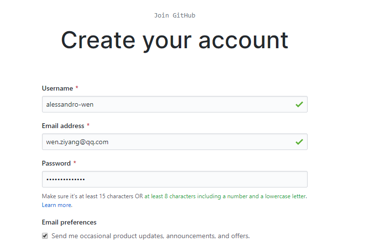

&#8195;3、验证活体身份、核实用户账户，验证成功后，点击 Next Select a plan

&#8195;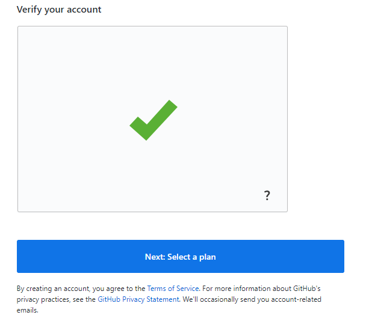

&#8195;4、选择个人版、还是专业版 

&#8195;额，一般对于新手来讲免费版就绰绰有余了，所以这里直接选择 Chooes Free即可，

&#8195;当然了，如果你有一个Team在做开发，那么7美元一个月也算不上很贵了！

&#8195;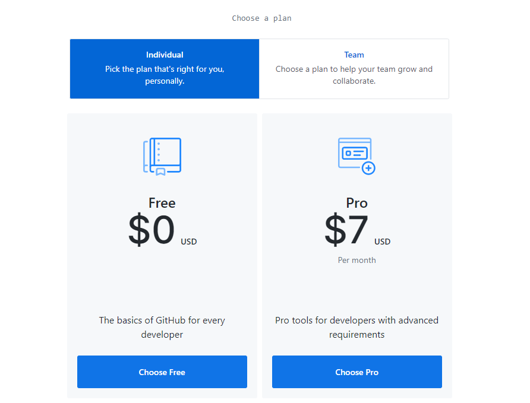

|个人免费版                                                   | 团队专业版   （7美元 / 月）                                  |
|:----------------------------------------------------------- | ------------------------------------------------------------ |
|无限的公共仓库 无限的私人仓库 仅限3个合作者（用于私人存储库） 每月总计2,000分钟的行动 500MB的GitHub软件包存储 公共存储库的高级漏洞扫描 自动化安全更新 GitHub安全公告 问题和错误跟踪 项目管理 | 包含所有免费内容 无限合作者 每月总计3,000分钟的行动 1GB的GitHub软件包存储 私有GitHub页面和Wiki 私人受保护的分支机构 代码所有者 仓库见解 |

&#8195;5、选择你的开发经验

&#8195;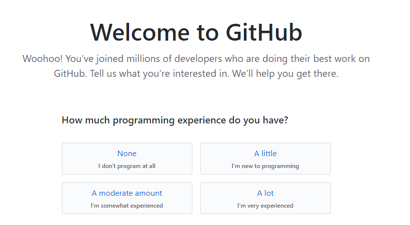

|None               | A little                       |
|------------------ | ------------------------------ |
|从来没有过编程经验 | 有一点，是一个新入门的编程新手 |
|**A moderate amount**  | **A lot** |
|从事过开发，有一些经验的开发者 | 有很多开发经验 |

&#8195;6、您打算将GitHub用于什么？（最多选择3个）

&#8195;关于这个，如果你从没接触过Git 一类的东西，我们直接选择第一行的三个即可

&#8195;如果你有一些编程经验，或者确实报着其他目的，按照想法点选即可，Git Hub会相应的给出一些帮助信息；

&#8195;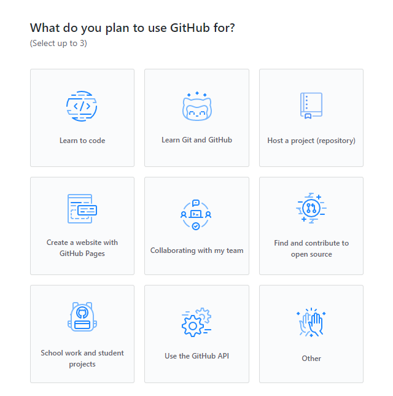

|学习代码                         | 学习Git和GitHub    | 托管项目（存储库）         |
|-------------------------------- | ------------------ | -------------------------- |
|**使用GitHub Pages创建一个网站** | **与我的团队合作** | **寻找开源并为此做出贡献** |
|**学校作业和学生项目**           | **使用GitHub API** | **其他**                   |

&#8195;7、填写感兴趣的信息，如语言，框架，行业等，当然了，你不知道什么语言、框架也可以不填写；

&#8195;8、最后点击 Complete setup，完成设置；

&#8195;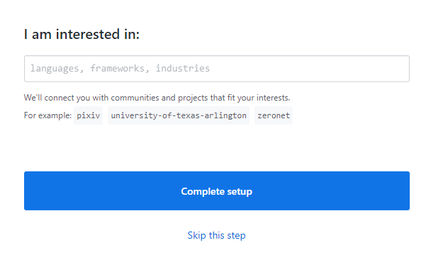

&#8195;9、这时Git Hub会给你发送一个邮件，用于确认用户，你只要按照提示登录一次即可！

&#8195;10、如果你没有确认邮箱中的邮件，你会看到这样一个提示

&#8195;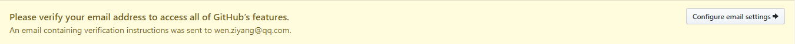

​	**Git Hub 创建仓库**

&#8195;这时你回到首页，中间会有一个大大的标志

&#8195;绿色的按钮是阅读指南，我用红色圈起来的按钮是创建一个仓库；

&#8195;我们直接点击 Start a project 创建一个仓库

&#8195;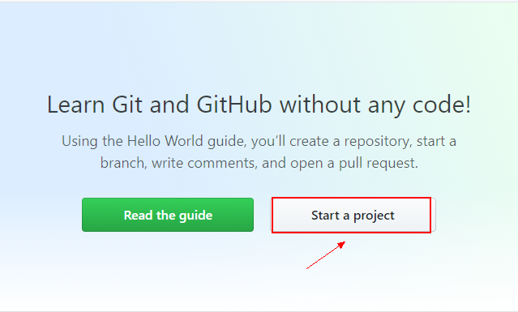

&#8195;按照提示，填写项目名，备注，创建Readme文件等；

&#8195;填写完成后，点击Create repository,创建仓库；

&#8195;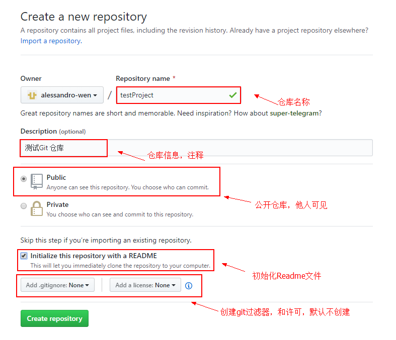

&#8195;到此，我们已经成功地创建了一个项目仓库

&#8195;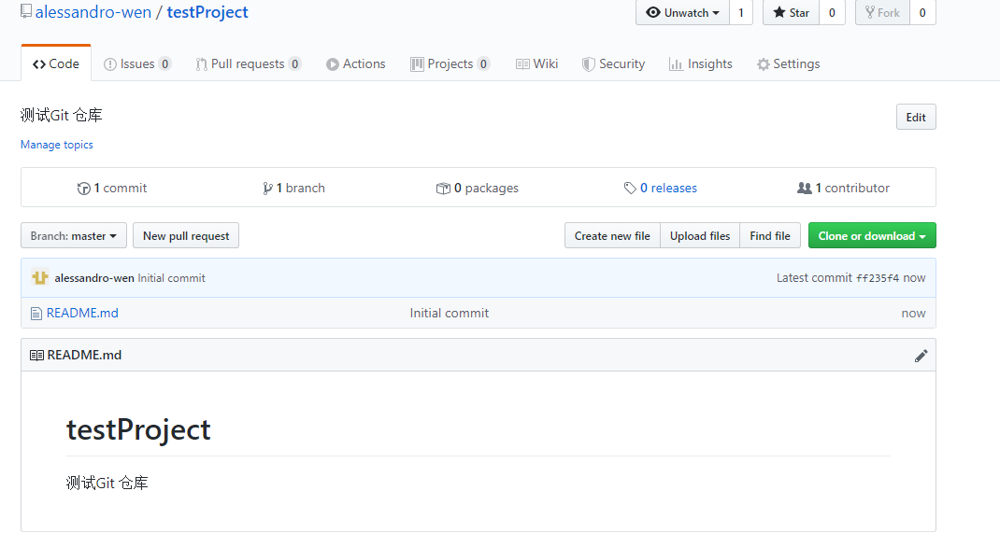

<h3>Git Hub Desktop安装与使用</h3>
&#8195;首先到官网下载 [Git Hub Desktop](https://desktop.github.com/) ,不过现在貌似被墙了！？

&#8195;Git Hub Desktop 是免安装步骤的，当你双击之后就能直接使用了；

&#8195;1、双击打开后，点击Sign into GitHub.com，登录Git Hub;

&#8195;2、输入我们之前创建好的Git Hub 邮箱和密码,点击Sign in

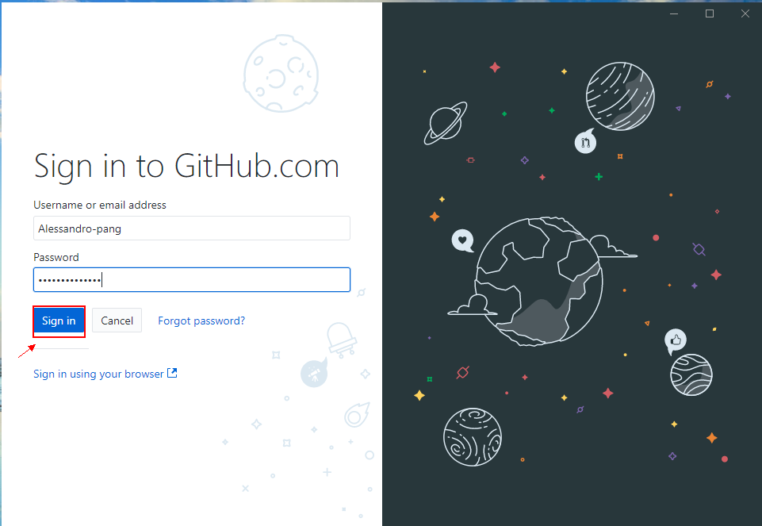

&#8195;3、点击Finish 完成登录；

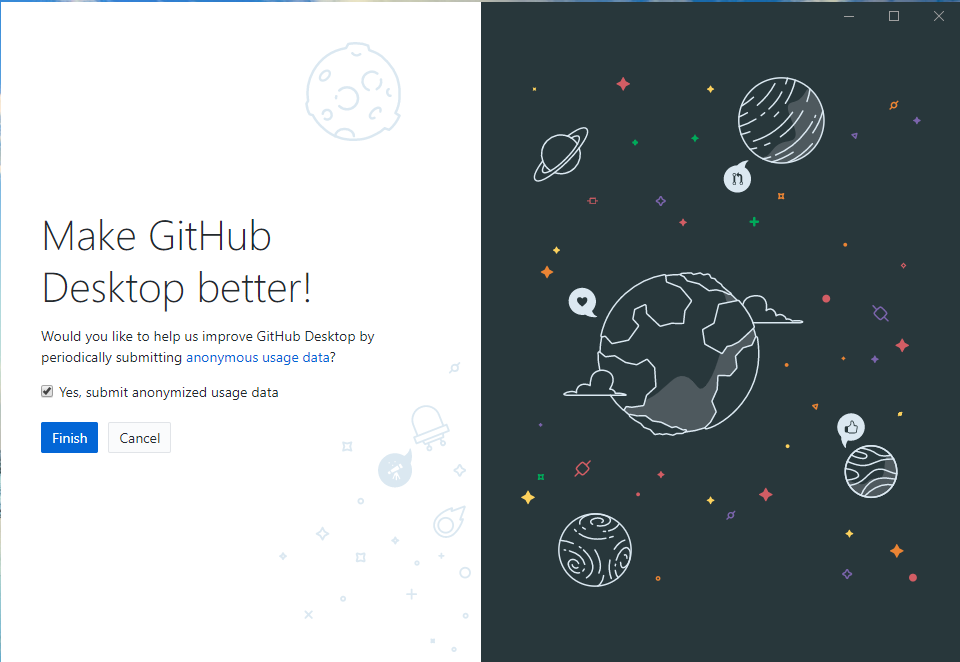

&#8195;4、登陆成功后，会提示你创建本地仓库，这里有三个选项：

| 创建一个新的项目到Git Hub | 添加本地仓库到Git Hub       | 从Git Hub上克隆一个项目到本地 |
| ------------------------- | --------------------------- | ----------------------------- |
| 适用于新建项目            | 适用于本地、Git Hub已有项目 | 适用于Git Hub有仓库，本地没有 |

&#8195;因为我们之前在Git Hub上创建了项目，所以这里选择克隆到本地

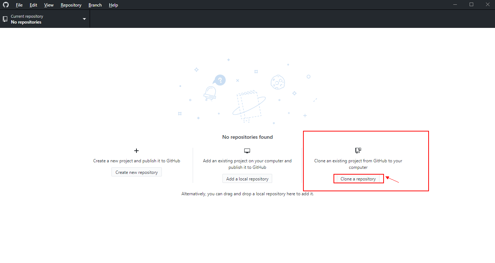

&#8195;点击之后，选择你在Git Hub上创建的项目

&#8195;在Local path 中选择你的保存路径，确保你自己能找到！！

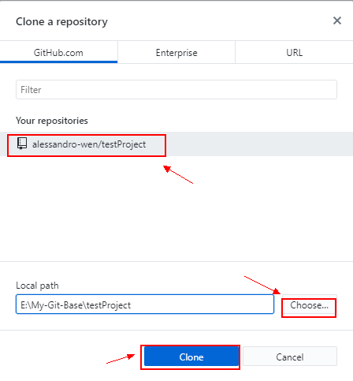

&#8195;5、打开页面后，会显示一片空白，不要慌，这是正常的！

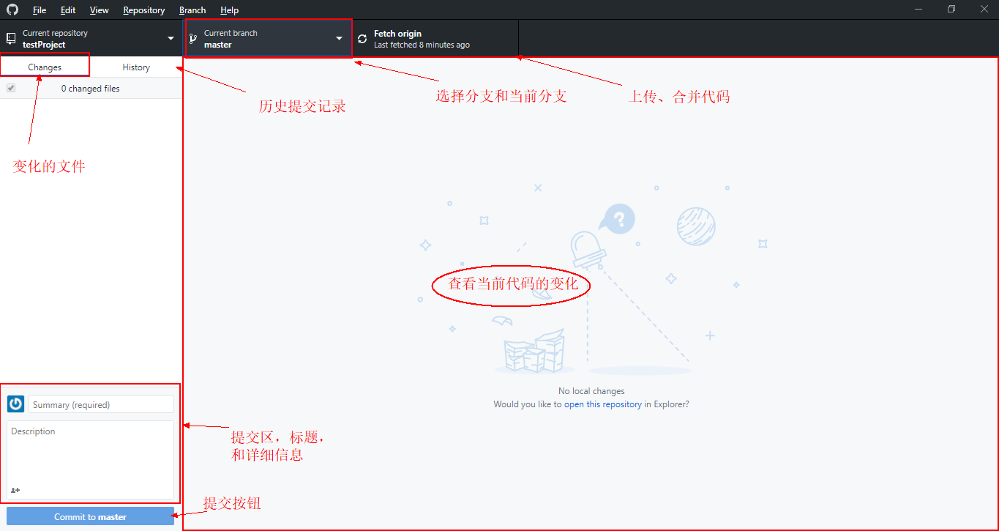

&#8195;6、我们找到之前的克隆项目，然后新建一个文件夹test，在文件夹下创建一个test.txt的文件；

&#8195;打开test.txt文件，我们在里面随便写一句话 “test git hub desktop”，并保存;

&#8195;这时再打开Git Hub Desktop就看到了变化;

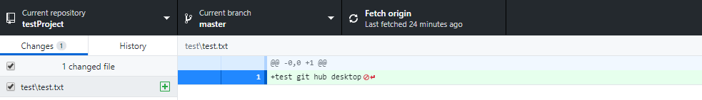

&#8195;7、我们再次打开 test.txt文件，删除之前写的那句话，重新写入几句话；

&#8195;保存文本，打开Desktop,就能看到新的变化；

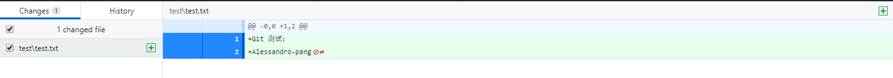

&#8195;8、我们现在提交一次代码；

&#8195;注意，我们应该先填写注释后点击 commit to master

&#8195;如果你直接点击了Fetch origin，一般有两种可能，没有反应和爆出错误；

&#8195;我们提交完毕后，页面又会回到最初的样子，我们再点击Fetch origin，静静的等待上传即可！

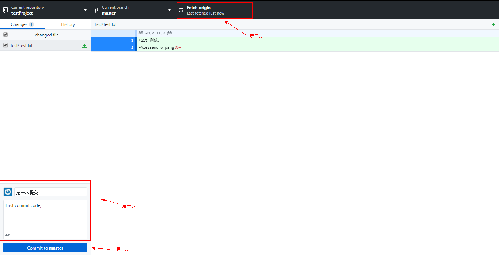

&#8195;9、我们现在再修改一次test.txt文件，这次删除一句话；

&#8195;你会发现这次的改变与之前的不同；

&#8195;当代码背景色为红色时，代表删除的代码；

&#8195;当代码背景色为绿色时，代表新增的代码；

&#8195;当然，他们前面也会有一个 `-` 和 一个 `+` 区别新增的代码和删除的代码；

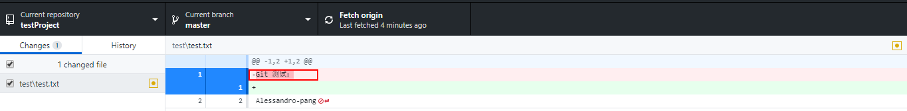

&#8195;10、我们按照上述流程再次提交一次代码

&#8195;点击History,我们可以看历史提交的信息，和改动的变化；

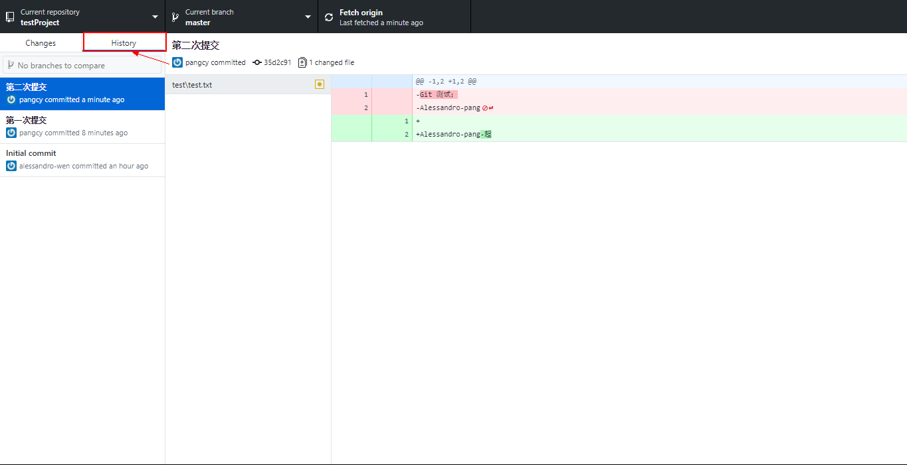

转载请注明：[庞超越的博客](http://www.alexpang.cn) » [点击阅读原文](https://www.alexpang.cn/2020/01/GitHubDesktop安装教程/) 