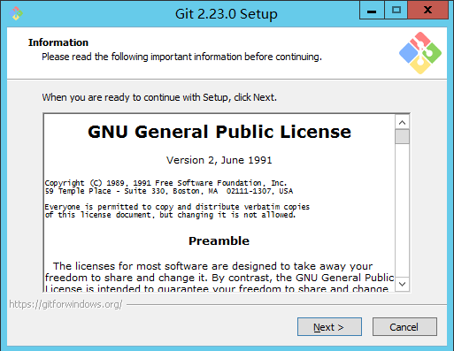
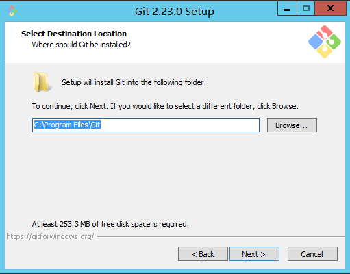
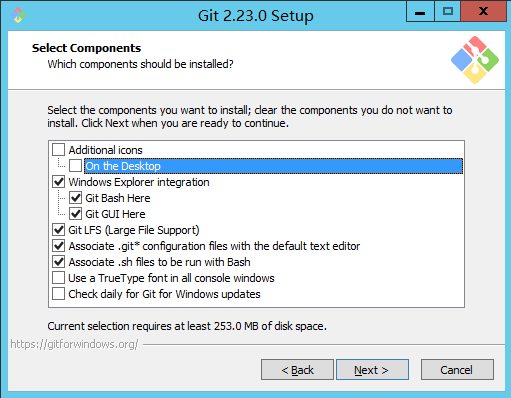

**简述：**

&#8195;关于Git 的介绍在上篇已经介绍过了，这次就不过多介绍Git的相关信息了;

&#8195; 至于 **<font color="red" weight="blod">Git 的安装问题？</font>**<font color="orange">其实你只要默认安装就可以了。。。！</font>

&#8195;当然了，既然单独写了一篇，自然是要写详细一些的，为了一些严谨的同学，简单介绍一下安装时的各个参数信息；

<h3>Git 安装教程</h3>
&#8195;由于笔者也没有过多试验过其中的参数所带来的变化，所以本文仅用于参考！更详细的配置信息烦请自行查阅官文:cry:;

&#8195;1、下载 Git 安装包 ：[官方下载](https://git-scm.com/downloads)

&#8195;Git 是免费的版本控制软件，可以直接在官方下载安装包；

&#8195;2、双击安装包，国际惯例，第一页基本都是让你同意某某许可，估计Git官方也知道用户不会读，所以连勾选这一步都省略了，直接点击 Next 下一步！



&#8195;3、选择你的安装路径，Git 大小不过200M，其实默认安装到C盘问题也不大,但要保证你选择的盘符还有260M以上的空间，用于安装Git和缓存；



&#8195;4、这一步是选择性的安装一些插件

```
1、Addtional icon - On the Desktop : 安装时在桌面生成快捷方式 (实际不是很需要，因为Git可以在cmd执行，另外Git会绑定鼠标右键，也可以打开)
2、windows explorer integration ： windows 资源管理器集成
3、
```

